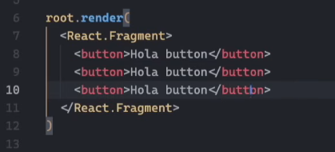
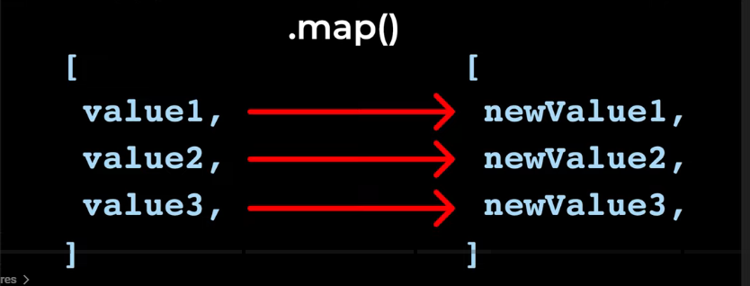
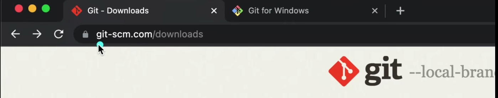
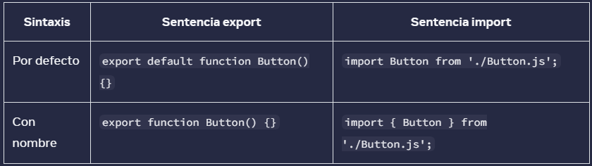
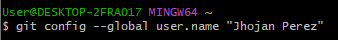
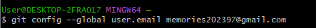

# REACT COURSE
¿De entre ayer y hoy que he aprendido de REACT?
React es una librería/framework para crear aplicativos visuales más fácilmente, usa como lenguaje base javascript el cual es traducido en JSX usando babel el cual es un traductor de javascript.
Al igual que bootstrap usa librerías para funcionar, las cuales están alojadas en etiquetas `<script>`
La syntaxis de react comienza con:

```html
<script type=”text/babel”></script>

```
Dentro de esta etiqueta HTML es donde React puede insertar contenedores HTML y estructurar la página por medio de javaScript. 
React usa la siguiente sintaxis para funcionar:

ReactDOM.createRoot(container).render(app)

Donde container es la etiqueta seleccionada del DOM donde las etiquetas React se van a insertar:

const container = document.querySelector(‘.js-container’)

Donde js-container es el selector de clase de una etiqueta <div> en el <body> del html.

Las funciones se siguen llamando igual: 

```jsx
	function nombreFuncion() {
	return(
	"Devuelve HTML "
	usualmente se debe devolver dentro de un `<div>`
	 )
	}
```
## State Event Hadlers

La listas con pair values se siguen guardando igual o parecido a python:
```jsx
const messages = [
	{message:'Hello', sender:'human'},
	{message:'hello back', sender:'robot'}
]
```

Se pueder usar los componentes de esta lista/diccionario en funciones dentro de la syntaxis de jsx. Dentro de la function principal **app()**. La funciones hechas de antermano se pueden pasar a jsx como html. **Para aplicarle una función a esta lista de keypairs se puede usar la propiedad `.map` que devuelve una lista igual pero con los mismos valores modificados.

```jsx
messages.map((e)=>{
	return (
		<ChatMessage 
			message={e.message}
			sender={e.sender}
		/>
	)
});
```
Todos los arrays deben de contar con un key value el cual es un identificador único `id`

##### Forma abreviada o más corta de guardar variables (?)


```jsx
const {message1} = messages
```

En este caso se trata de tomar el primer valor del array y se guarda en la variable `message1`, si quisieramos guardar el segundo valor del array sería de la siguiente manera:
```jsx
const {message1, message2} = messages
```

---

root.render solo renderiza un elemento, si se quitara `<React.Fragment></React.Fragment>` Solo generaría error

---
##### Un componente es una función que devuelve un elemento
---

.map solo funciona con arrays, es una propiedad de los arrays

---
`useState()` permite actualizar HTML, siempre devolverá 2 valores, el primer valor es el array sin modificar y el segundo será el array modificado listo para usar como HTML.
Para extraer estos dos valores es común utilizar **destructuring:**
```jsx
const arrayOfElements = React.useState(array)

const [normalArray, setnormalArray] = arrayOfElements
```

---

para copiar valores de objetos:
```jsx
...normalArray
```


---
### Día 3 aprendiendo React
Que he aprendido desde la última vez que hice un entrada?

* Instalación de nodejs o algo así parecido
* Instalación de paquetes por medio del comando npm
* Existe una librería de paquetes que puede instalar el comando npm
* Se pueden guardar elementos HTML en variables o constantes Javascript
* La propiedad Justify-content de css siempre está ?
* La propiedad border-round para redondear bordes en css
* React usa css de igual manera, nada cambia (muy muy poco)
* React no usa `class` para llamar etiquetas sino: `className`
* Existen varios tipos de "Nomenclaturas" para llamar variables las cuales son: camelCase, Pascalcase, snake_case y kebab-case
* El uso del hook useState() que devuelve un array sin modificar y otro modificado a modo de HTML
* Que las funciones también se pueden inicializar como `class` dentro de javascript pero tienen un significado algo diferente que aún no entiendo bien.
* Vite es un empaquetador de código que permite hacer que el navegador corra mi código
* Babel y cws son inline translators lo que quiere decir que traducen jsx en javascript, aparentemente el más usado es CWS
* El uso de operdador ternario para definir if statements en linea
```jsx
(object ? dothis : dothisotherthing)
```

* `React.useRef` como un hook de react que permite guardar código de alguna etiqueta dentro de jsx y usarlo en otra parte del código
* `React.useEffect` como una función que se actualiza cada vez que ocurre algún cambio en algún componente del código 
---
### Día 4 aprendiendo react
* eslint
* javascript feature: modules
* export function
* export default
* separación de archivos y componentes
* operador spread javascript
Página de instalación de git:

Nota: no utilizar la terminal de windows cmd, usar `gitbash`
* Uso de git, configuración inicial, status, add, commit, comandos git
* git unit o uint
* conventional commits
* git branch
* git ignore

---
### Día 5 aprendiendo react
* Routing
* Comando: npm react routing
```jsx
<route="/">
<route index>
```
* ctrl + shift + p => format document

### Día 9 aprendiendo react

#### Desde la página de React
* Import y export, export default y con nombre
* JSX es muy estricto, devolver múltiples etiquetas en **Fragmentos**
* Llaves en JSX y objetos dentro de esas llaves {{}}
#### git instalación
* git config --global user.name "(nombreUsuario)"es para todos los proyectos, es la configuración global

* `git config --global user.email` configuración correo electrónico 

* `git config --global core.editor "code --wait"` Configuración editor de texto (`--wait` significa que git estará esperando a que editor de texto se abre o se cierra)
* Abrir el archivo de configuración global: `git config --global -e"`
* Configuración del carácter especial crlf, windows tiene dos carácteres especiales para hacer salto de linea, cr y lf, mientras que los usuarios de apple tienen solo uno, por así decirlo el carácter global es el `lf`, así que hay que quitar el carácter cr cuando se descarga de un servidor solo sí se es de windows:  `git config --global core.autocrlf true`
* Una vez de estar dentro de la carpeta deseada del proyecto usar `git init` para inicializar el repositorio. Usar `ls -a` para mostrar todos los archivos incluidos los que no se ven.
* Usar git status para ver los cambios o archivos que se han añadido

* git status y git add para añadir archivos, `git commit -m "(mensaje)"` para commit, también se puede usar `git commit` solamente y se abrirá el editor de texto para modificar el commit de una forma diferente.
### Día 11 aprendiendo react
* uso de git: `.gitignore` para ignorar archivos cuando salen con `git status`. De igual forma con `.gitignore` si hay que añadirlo a stage 
* uso de git: `git status -s` short se usa para abreviar el proceso? `git diff` se usa para ver los cambios en los documentos, ``git diff --staged` muestra los cambios hechos en la etapa de stage.
* uso de git: `git log --oneline` muestra el historial de modificaciones
* uso de git: `git branch` sirve para mostrar la rama en la que se encuentra, `git checkout -b ramab` sirve para cambiar y crear una nueva rama.
* uso de git: `git merge ramab` sirve para fusionar las ramas, en este ejemplo usando `ramab` previamente creada
* uso de git: `git push` para subir todos los commits hechos al repositorio de git hub
* uso de git: `git push -u origin ramaC` para añadir otra rama al repositorio de git